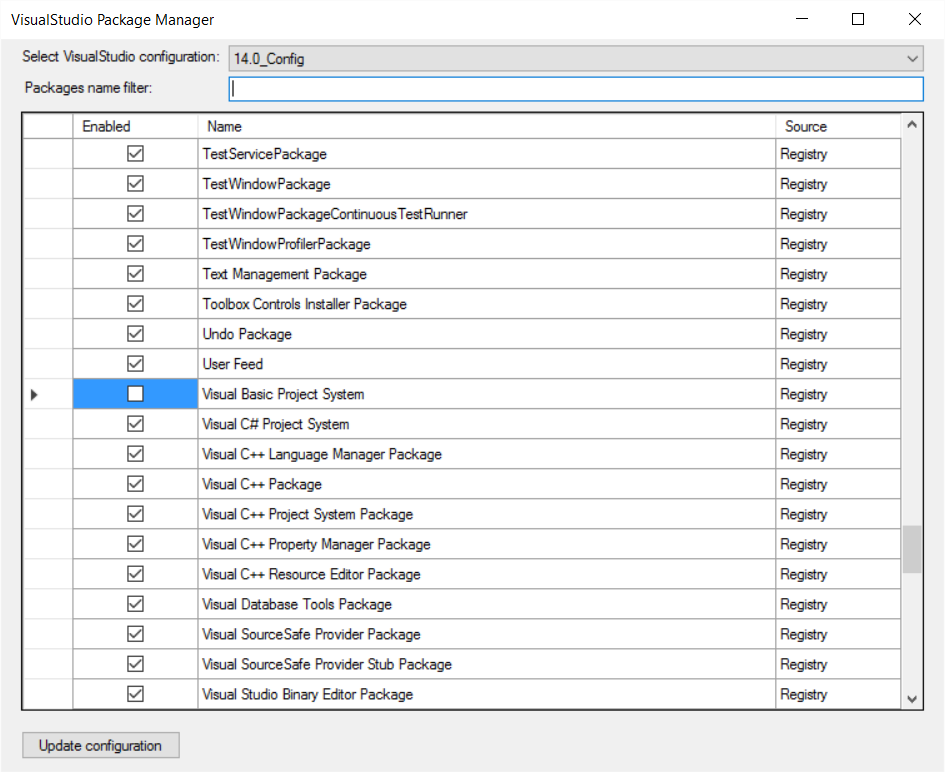

# VSPM - Visual Studio Package Manager
Manage packages loaded within Visual Studio (Tested with Dev14=VS 2015)

Inspired by the work of https://github.com/hmemcpy/SlimVS by Igal Tabachnik

The tool is able to dump packages from HKCU\SOFTWARE\Microsoft\VisualStudio\14.0_Config\Packages (and other DevXX configurations).
You can then select packages you want to keep loaded.

The tool will create devenv.pkgundef file with packages to skip in your C:\Program Files (x86)\Microsoft Visual Studio 14.0\Common7\IDE (next to devenv.exe), and will run devenv /updateconfiguration for you.
The next time Visual Studio starts, it will refresh the pkgdef cache, and will remove all the packages specified in the pkgundef file.

To quickly undo everything, reuse the tool or delete the devenv.pkgundef file, and run devenv /updateconfiguration again.

This tool is for advanced users, be aware that you can break everything if you don't know what you are doing. 

